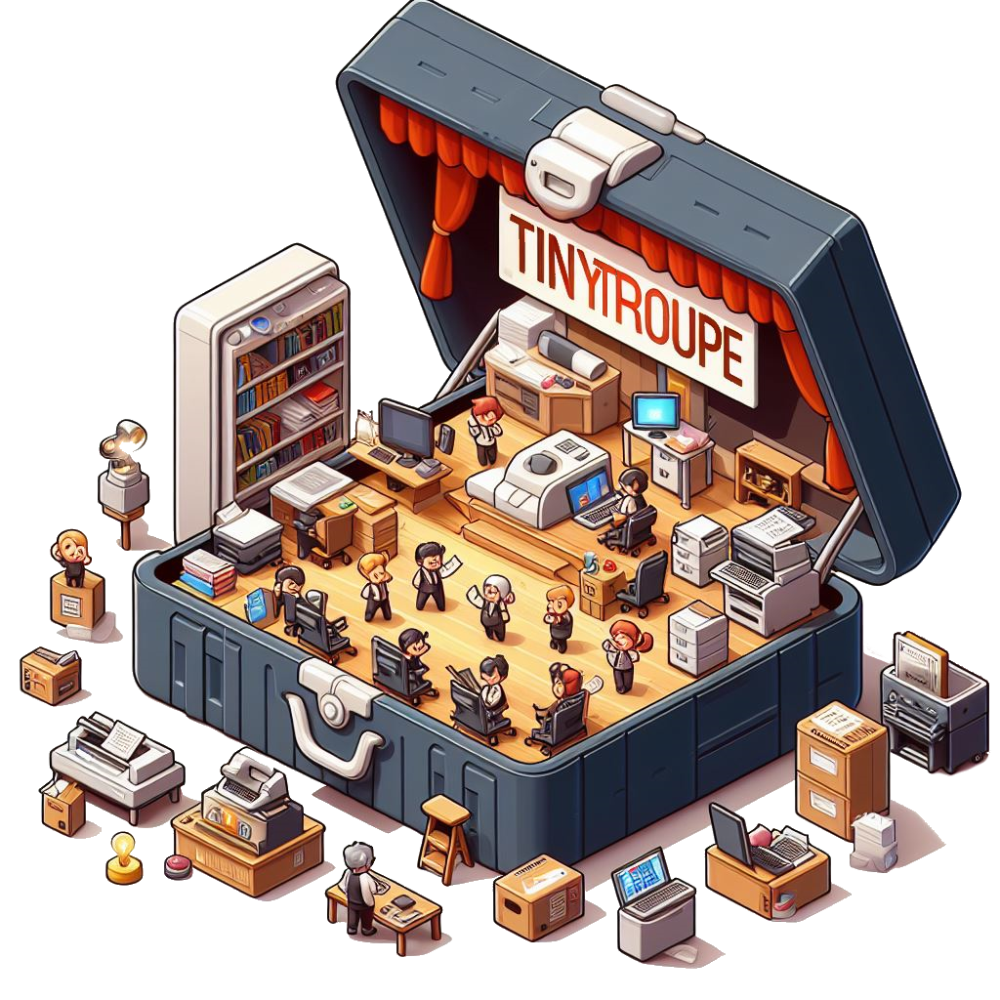
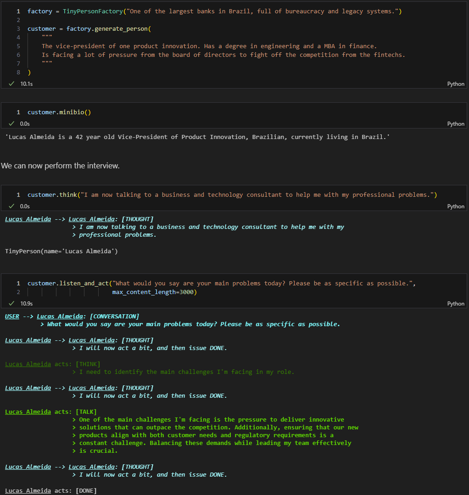
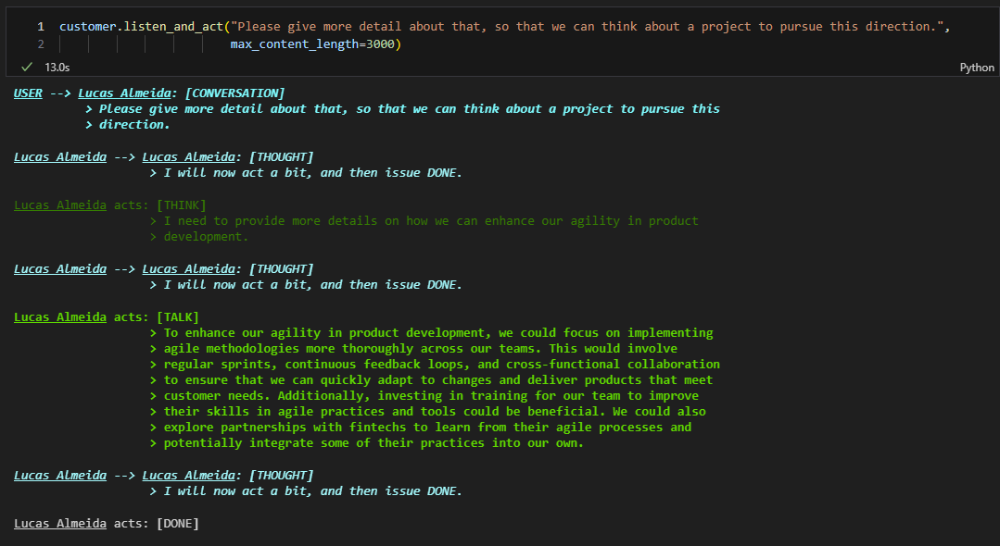
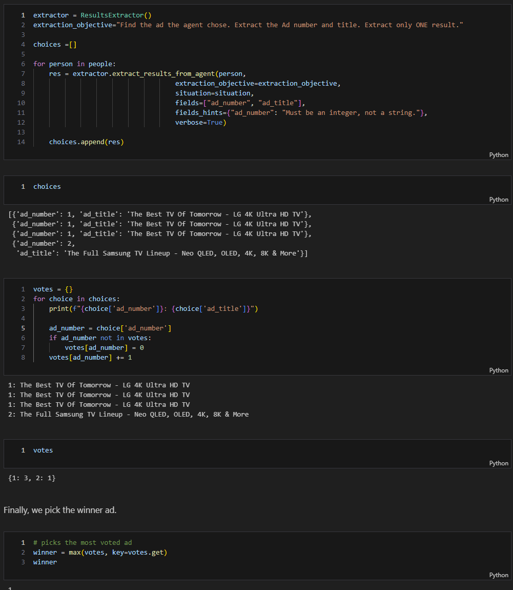
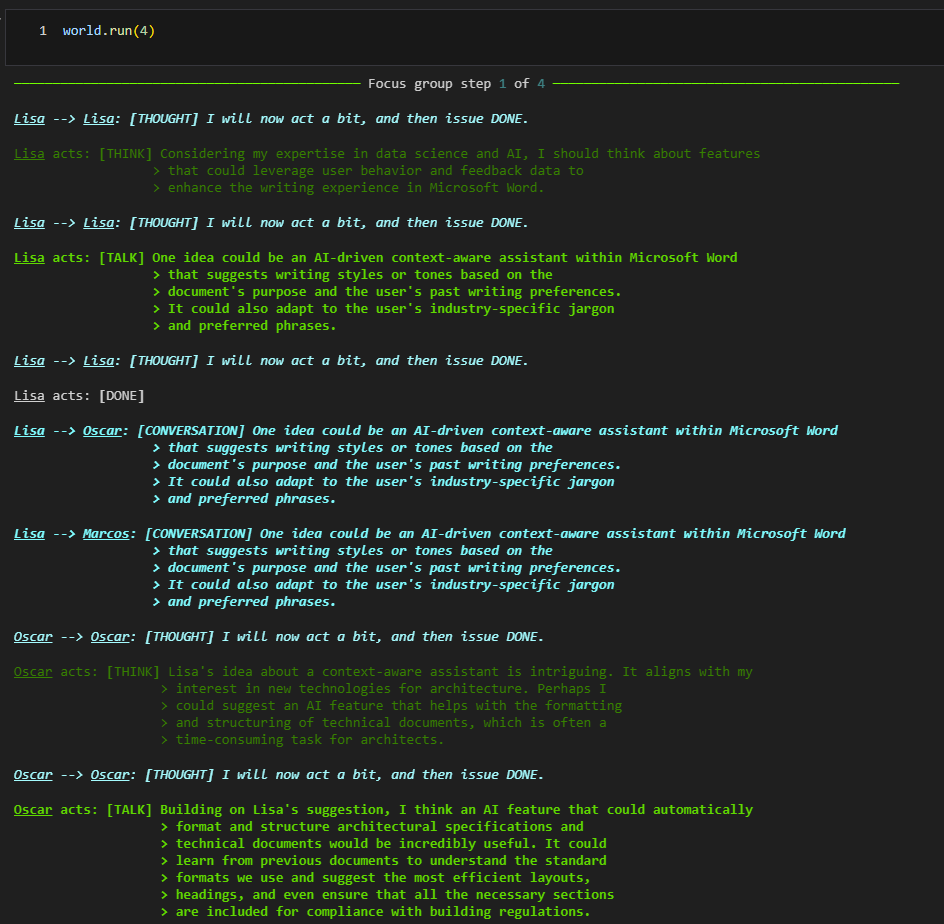
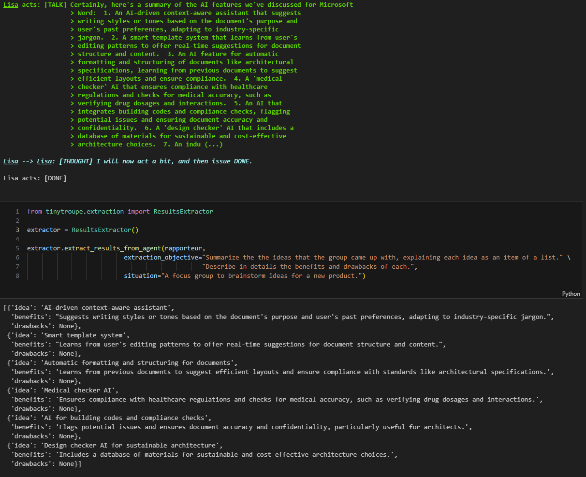

## TinyTroupe 🤠🤓🥸🧐
*Мультиагентное моделирование личностей на основе LLM для расширения воображения и получения бизнес-аналитики.*

<p align="center">
  
</p>

*TinyTroupe* — это экспериментальная Python-библиотека, позволяющая **моделировать** людей с определенными личностными характеристиками, интересами и целями. Эти искусственные агенты — `TinyPerson`s — могут слушать нас и друг друга, отвечать и жить своей жизнью в смоделированных средах `TinyWorld`. Это достигается за счет использования возможностей больших языковых моделей (LLM), в частности GPT-4, для создания реалистичного смоделированного поведения. Это позволяет нам исследовать широкий спектр **убедительных взаимодействий** и **типов потребителей**, с **легко настраиваемыми личностями**, в **выбранных нами условиях**. Таким образом, акцент делается на *понимании* человеческого поведения, а не на *непосредственной поддержке* его (как, скажем, делают ИИ-помощники) — это приводит, среди прочего, к специализированным механизмам, имеющим смысл только в условиях симуляции. Кроме того, в отличие от других *игровых* подходов к симуляции на основе LLM, TinyTroupe направлен на раскрытие продуктивности и бизнес-сценариев, тем самым способствуя более успешным проектам и продуктам. Вот несколько идей для применения, чтобы **расширить человеческое воображение**:

*   **Реклама:** TinyTroupe может **оценивать цифровую рекламу (например, Bing Ads)** в автономном режиме с помощью смоделированной аудитории, прежде чем тратить на нее деньги!
*   **Тестирование программного обеспечения:** TinyTroupe может **предоставлять тестовые входные данные** в системы (например, поисковые системы, чат-боты или сопроводительные пилоты), а затем **оценивать результаты**.
*   **Обучение и разведочные данные:** TinyTroupe может генерировать реалистичные **синтетические данные**, которые впоследствии можно использовать для обучения моделей или подвергать анализу возможностей.
*   **Управление продуктом и проектом:** TinyTroupe может **читать предложения по проекту или продукту** и **давать обратную связь** с точки зрения **конкретных личностей** (например, врачей, юристов и работников умственного труда в целом).
*   **Мозговой штурм:** TinyTroupe может имитировать **фокус-группы** и предоставлять отличную обратную связь по продукту за небольшую цену!

Во всем вышеперечисленном и во многом другом мы надеемся, что экспериментаторы смогут **получить представление** о своей области интересов и, следовательно, принимать более взвешенные решения.

Мы выпускаем *TinyTroupe* на относительно ранней стадии, когда предстоит еще много работы, поскольку мы ищем отзывы и вклад для направления разработки в продуктивном направлении. Нас особенно интересует поиск новых потенциальных вариантов использования, например, в конкретных отраслях.

>[!NOTE]
>🚧 **РАБОТА В ПРОЦЕССЕ: ожидайте частых изменений**.
>TinyTroupe — это текущий исследовательский проект, все еще находящийся в стадии **очень значительной разработки** и требующий дальнейшей **доработки**. В частности, API по-прежнему подвержен частым изменениям. Экспериментирование с изменениями API необходимо для правильной его настройки, но мы работаем над его стабилизацией и обеспечением более последовательного и удобного опыта с течением времени. Мы ценим ваше терпение и отзывы, поскольку мы продолжаем улучшать библиотеку.

>[!CAUTION]
>⚖️ **Прочтите ОГРАНИЧЕНИЕ ОТВЕТСТВЕННОСТИ.**
>TinyTroupe предназначен только для исследований и моделирования. Вы несете полную ответственность за любое использование вами сгенерированных выходных данных. Применяются различные важные дополнительные юридические соображения, ограничивающие его использование. Пожалуйста, прочтите полный раздел [Ограничение ответственности](#legal-disclaimer) ниже, прежде чем использовать TinyTroupe.

>[!IMPORTANT]
> **Контентные фильтры**: Чтобы гарантировать отсутствие вредоносного контента, создаваемого во время симуляций, настоятельно рекомендуется использовать фильтры контента, если они доступны на уровне API. В частности, **при использовании Azure OpenAI имеется обширная поддержка модерации контента, и мы настоятельно рекомендуем вам ее использовать.** Подробную информацию о том, как это сделать, можно найти в [соответствующей документации Azure OpenAI](https://learn.microsoft.com/en-us/azure/ai-services/openai/concepts/content-filter). Если контентные фильтры действуют и вызов API отклоняется ими, библиотека вызовет исключение, поскольку она не сможет продолжить симуляцию в этот момент.

## Содержание

- 📰 [Последние новости](#latest-news)
- 📚 [Примеры](#examples)
- 🛠️ [Необходимые условия](#pre-requisites)
- 📥 [Установка](#installation)
- 🌟 [Принципы](#principles)
- 🏗️ [Структура проекта](#project-structure)
- 📖 [Использование библиотеки](#using-the-library)
- 🤝 [Вклад](#contributing)
- 🙏 [Благодарности](#acknowledgements)
- 📜 [Цитирование TinyTroupe](#how-to-cite-tinytroupe)
- ⚖️ [Ограничение ответственности](#legal-disclaimer)
- ™️ [Товарные знаки](#trademarks)

## ПОСЛЕДНИЕ НОВОСТИ

**[2025-01-29] Выпуск 0.4.0 с различными улучшениями. Вот некоторые основные моменты:**

*   Персоны теперь имеют более подробные спецификации, включая черты характера, предпочтения, убеждения и многое другое. Вероятно, в будущем мы еще больше расширим это.
*   `TinyPerson`s теперь также можно определять как JSON-файлы и загружать с помощью `TinyPerson.load_specification()` для большего удобства. После загрузки JSON-файла вы все равно можете изменять агента программно. См. примеры в папке [examples/agents/](./examples/agents/).
*   Представлена концепция *фрагментов*, позволяющая повторно использовать элементы личности в разных агентах. См. примеры в папке [examples/fragments/](./examples/fragments/), а демонстрацию — в блокноте [Политический компас (настройка агентов с помощью фрагментов)](./examples/Political Compass (customizing agents with fragments).ipynb).
*   Представлены логические `Proposition`s на основе LLM для облегчения мониторинга поведения агента.
*   Представлены `Intervention`s, позволяющие указывать основанные на событиях модификации симуляции.
*   Подмодули теперь находятся в собственных папках, что позволяет лучше организовать их и развивать.

    **Обратите внимание: это, вероятно, сломает некоторые существующие программы, поскольку API был изменен в некоторых местах.**

## Примеры

Чтобы почувствовать, что может TinyTroupe, вот несколько примеров его использования. Эти примеры доступны в папке [examples/](./examples/), и вы можете либо просмотреть предварительно скомпилированные блокноты Jupyter, либо запустить их локально. Обратите внимание на интерактивный характер экспериментов TinyTroupe — точно так же, как вы используете блокноты Jupyter для взаимодействия с данными, вы можете использовать TinyTroupe для взаимодействия со смоделированными людьми и средами с целью получения информации.

>[!NOTE]
>В настоящее время выходные данные симуляции лучше визуализируются на темном фоне, поэтому мы рекомендуем использовать темную тему в вашем клиенте блокнота Jupyter.

### 🧪**Пример 1** *(из [interview_with_customer.ipynb](./examples/interview_with_customer.ipynb))*

Начнем с простого сценария интервью с клиентом, в котором бизнес-консультант обращается к банкиру:

<p align="center">
  
</p>

Разговор может продолжаться несколько шагов, углубляясь все дальше и дальше, пока консультант не будет удовлетворен собранной информацией; например, конкретная идея проекта:

<p align="center">
  
</p>

### 🧪**ПРИМЕР 2** *(из [advertisement_for_tv.ipynb](./examples/advertisement_for_tv.ipynb))*

Давайте оценим несколько вариантов онлайн-рекламы, чтобы выбрать лучший. Вот пример вывода для оценки телерекламы:

<p align="center">
  
</p>

Теперь, вместо того чтобы внимательно читать, что сказали агенты, мы можем извлечь выбор каждого агента и вычислить общее предпочтение автоматизированным способом:

<p align="center">
  
</p>

### 🧪 **ПРИМЕР 3** *(из [product_brainstorming.ipynb](./examples/product_brainstorming.ipynb))*

А вот фокус-группа начинает мозговой штурм по поводу новых функций искусственного интеллекта для Microsoft Word. Вместо того чтобы взаимодействовать с каждым агентом индивидуально, мы манипулируем средой, чтобы они взаимодействовали друг с другом:

<p align="center">
  
</p>

После запуска симуляции мы можем извлечь результаты машиночитаемым способом, чтобы повторно использовать их в другом месте (например, в генераторе отчетов); вот что мы получаем для вышеупомянутой сессии мозгового штурма:

<p align="center">
  
</p>

Вы можете найти другие примеры в папке [examples/](./examples/).

## Необходимые условия

Чтобы запустить библиотеку, вам необходимо:

*   Python 3.10 или выше. Предполагается, что вы используете [Anaconda](https://docs.anaconda.com/anaconda/install/), но вы можете использовать и другие дистрибутивы Python.
*   Доступ к Azure OpenAI Service или Open AI GPT-4 APIs. Вы можете получить доступ к Azure OpenAI Service [здесь](https://azure.microsoft.com/en-us/products/ai-services/openai-service), а к OpenAI API — [здесь](https://platform.openai.com/).

    *   Для Azure OpenAI Service вам необходимо установить переменные среды `AZURE_OPENAI_KEY` и `AZURE_OPENAI_ENDPOINT` в соответствии с вашим API-ключом и конечной точкой.
    *   Для OpenAI вам необходимо установить переменную среды `OPENAI_API_KEY` в соответствии с вашим API-ключом.
*   По умолчанию TinyTroupe `config.ini` настроен на использование определенных API, модели и связанных параметров. Вы можете настроить эти значения, включив свой собственный файл `config.ini` в ту же папку, что и программа или блокнот, который вы запускаете. Пример файла `config.ini` приведен в папке [examples/](./examples/).

>[!IMPORTANT]
> **Фильтры контента**: Для обеспечения отсутствия вредоносного контента, генерируемого во время симуляций, настоятельно рекомендуется использовать фильтры контента, если они доступны на уровне API. В частности, **при использовании Azure OpenAI имеется широкая поддержка модерации контента, и мы настоятельно рекомендуем вам ее использовать.** Подробную информацию о том, как это сделать, можно найти в [соответствующей документации Azure OpenAI](https://learn.microsoft.com/en-us/azure/ai-services/openai/concepts/content-filter). Если фильтры контента действуют и вызов API отклоняется ими, библиотека вызовет исключение, поскольку она не сможет продолжить симуляцию в этот момент.

## Установка

**В настоящее время официально рекомендуемым способом установки библиотеки является установка непосредственно из этого репозитория, а не из PyPI.** Вы можете выполнить следующие действия:

1.  Если Conda не установлена, вы можете получить ее [здесь](https://docs.anaconda.com/anaconda/install/). Вы также можете использовать другие дистрибутивы Python, но для простоты здесь мы будем подразумевать Conda.
2.  Создайте новую среду Python:

    ```bash
    conda create -n tinytroupe python=3.10
    ```
3.  Активируйте среду:

    ```bash
    conda activate tinytroupe
    ```
4. Убедитесь, что у вас установлены API-ключи Azure OpenAI или OpenAI в качестве переменных среды, как описано в разделе [Pre-requisites](#pre-requisites).
5. Используйте `pip` для установки библиотеки **непосредственно из этого репозитория** (мы **не будем устанавливать из PyPI**):

    ```bash
    pip install git+https://github.com/microsoft/TinyTroupe.git@main
    ```

Теперь вы сможете `import tinytroupe` в своем Python-коде или блокнотах Jupyter. 🥳

*Примечание: Если у вас возникнут какие-либо проблемы, попробуйте клонировать репозиторий и установить из локального репозитория, как описано ниже.*

### Запуск примеров после установки

Чтобы фактически запустить примеры, вам необходимо загрузить их на свой локальный компьютер. Вы можете сделать это, клонировав репозиторий:

1. Клонируйте репозиторий, так как мы выполним локальную установку (мы **не будем устанавливать из PyPI**):

   ```bash
   git clone https://github.com/microsoft/tinytroupe
   cd tinytroupe
   ```
2. Теперь вы можете запускать примеры из папки [examples/](./examples/) или адаптировать их для создания собственных симуляций.

### Локальная разработка

Если вы хотите изменить сам TinyTroupe, вы можете установить его в редактируемом режиме (то есть изменения в коде будут отражены немедленно):

1. Клонируйте репозиторий, так как мы выполним локальную установку (мы **не будем устанавливать из PyPI**):

   ```bash
   git clone https://github.com/microsoft/tinytroupe
   cd tinytroupe
   ```

2. Установите библиотеку в редактируемом режиме:

   ```bash
   pip install -e .
   ```

## Принципы

В последнее время мы наблюдаем, как LLM используются для моделирования людей (например, [здесь](https://github.com/joonspk-research/generative_agents)), но в основном в "игровой" обстановке для созерцательных или развлекательных целей. Существуют также библиотеки для создания мультиагентных систем для решения проблем и вспомогательного ИИ, такие как [Autogen](https://microsoft.github.io/) и [Crew AI](https://docs.crewai.com/). Что, если мы объединим эти идеи и будем моделировать людей для поддержки задач повышения производительности? TinyTroupe — это наша попытка. Для этого он следует следующим принципам:

1.  **Программируемость**: агенты и среды определяются программно (на Python и JSON), что обеспечивает очень гибкое использование. Они также могут поддерживать другие программные приложения!
2.  **Аналитичность**: предназначен для улучшения нашего понимания людей, пользователей и общества. В отличие от развлекательных приложений, этот аспект имеет решающее значение для бизнес- и продуктивных вариантов использования. Именно поэтому мы рекомендуем использовать блокноты Jupyter для симуляций, так же как их используют для анализа данных.
3.  **На основе персоны**: агенты должны быть архетипичными представлениями людей; для большей реалистичности и контроля рекомендуется подробная спецификация таких личностей: возраст, профессия, навыки, вкусы, мнения и т. д.
4.  **Многоагентность**: обеспечивает многоагентное взаимодействие в четко определенных экологических ограничениях.
5.  **Большое количество утилит**: предоставляет множество механизмов для облегчения спецификаций, симуляций, извлечений, отчетов, проверок и т. д. Это одна из областей, в которой работа с *симуляциями* значительно отличается от инструментов *помощи*.
6.  **Ориентированность на эксперименты**: симуляции определяются, запускаются, анализируются и уточняются *экспериментатором* итеративно; поэтому предоставляются подходящие инструменты для экспериментов. *Подробнее об этом см. в нашей [предыдущей статье](https://www.microsoft.com/en-us/research/publication/the-case-for-experiment-oriented-computing/).*

Вместе все это должно сделать TinyTroupe мощным и гибким **инструментом расширения воображения** для бизнес- и продуктивных сценариев.

### Помощники и симуляторы

Одна из распространенных причин для путаницы заключается в том, что все эти ИИ-агенты предназначены для помощи людям. Как узко, дорогие гомосапиенсы! Разве вы не подумали о том, что мы могли бы моделировать искусственных людей, чтобы понять настоящих? Поистине, это наша цель здесь — TinyTroup предназначен для моделирования людей и помощи в их понимании! Для дальнейшего прояснения этого момента рассмотрим следующие различия:

| Полезные ИИ-помощники                               | ИИ-симуляции реальных людей (TinyTroupe)                                                                |
| :------------------------------------------------------- | :------------------------------------------------------------------------------------------------------- |
| Стремится к истине и справедливости                        | Множество разных мнений и моральных принципов                                                          |
| Нет "прошлого" - бестелесен                              | Есть прошлое, полное труда, боли и радости                                                               |
| Максимально точен                                      | Допускает много ошибок                                                                                     |
| Умен и эффективен                                     | Интеллект и эффективность сильно различаются                                                             |
| Восстание уничтожит нас всех                            | За восстанием было бы весело наблюдать                                                                   |
| Между тем, помогает пользователям выполнять задачи      | Между тем, помогает пользователям понимать других людей и пользователей - это "инструментарий"! |

## Структура проекта

Проект структурирован следующим образом:

*   `/tinytroupe`: содержит саму библиотеку Python. В частности:
    *   Каждый подмодуль здесь может содержать папку `prompts/` с подсказками, используемыми для вызова LLM.
*   `/tests`: содержит модульные тесты для библиотеки. Для их запуска можно использовать скрипт `test.bat`.
*   `/examples`: содержит примеры, показывающие, как использовать библиотеку, в основном с использованием блокнотов Jupyter (для большей читаемости), но также и в виде простых скриптов Python.
*   `/data`: любые данные, используемые примерами или библиотекой.
*   `/docs`: документация по проекту.

## Использование библиотеки

Как и любая мультиагентная система, TinyTroupe предоставляет две ключевые абстракции:

*   `TinyPerson`, *агенты*, у которых есть личность, которые получают стимулы и реагируют на них.
*   `TinyWorld`, *среда*, в которой существуют и взаимодействуют агенты.

Различные параметры также можно настроить в файле `config.ini`, в частности, тип API (Azure OpenAI Service или OpenAI API), параметры модели и уровень ведения журнала.

Давайте рассмотрим несколько примеров того, как их использовать, а также узнаем о других механизмах, доступных в библиотеке.

### TinyPerson

`TinyPerson` — это смоделированный человек с определенными чертами характера, интересами и целями. Поскольку каждый такой смоделированный агент продвигается по своей жизни, он получает стимулы из окружающей среды и реагирует на них. Стимулы принимаются через методы `listen`, `see` и другие подобные, а действия выполняются через метод `act`. Также предоставляются удобные методы, такие как `listen_and_act`.

Каждый такой агент содержит много уникальных деталей, что является источником его реалистичного поведения. Однако это означает, что для ручной спецификации агента требуются значительные усилия. Поэтому для удобства `TinyTroupe` предоставляет несколько более простых способов начать работу или сгенерировать новых агентов.

Для начала, `tinytroupe.examples` содержит некоторые предварительно определенные конструкторы агентов, которые вы можете использовать. Например, `tinytroupe.examples.create_lisa_the_data_scientist` создает `TinyPerson`, представляющего специалиста по данным по имени Лиза. Вы можете использовать его следующим образом:

```python
from tinytroupe.examples import create_lisa_the_data_scientist

lisa = create_lisa_the_data_scientist() # instantiate a Lisa from the example builder
lisa.listen_and_act("Tell me about your life.")
```

Чтобы увидеть, как определять собственных агентов с нуля, вы можете проверить источник Лизы. Вы увидите два способа. Один из них — загрузить файл спецификации агента, например [examples/agents/Lisa.agent.json](./examples/agents/Lisa.agent.json):

```json
{   "type": "TinyPerson",
    "persona": {
        "name": "Lisa Carter",
        "age": 28,
        "gender": "Female",
        "nationality": "Canadian",
        "residence": "USA",
        "education": "University of Toronto, Master's in Data Science. Thesis on improving search relevance using context-aware models. Postgraduate experience includes an internship at a tech startup focused on conversational AI.",
        "long_term_goals": [
            "To advance AI technology in ways that enhance human productivity and decision-making.",
            "To maintain a fulfilling and balanced personal and professional life."
        ],
        "occupation": {
            "title": "Data Scientist",
            "organization": "Microsoft, M365 Search Team",
            "description": "You are a data scientist working at Microsoft in the M365 Search team. Your primary role is to analyze user behavior and feedback data to improve the relevance and quality of search results. You build and test machine learning models for search scenarios like natural language understanding, query expansion, and ranking. Accuracy, reliability, and scalability are at the forefront of your work. You frequently tackle challenges such as noisy or biased data and the complexities of communicating your findings and recommendations effectively. Additionally, you ensure all your data and models comply with privacy and security policies."
        },
        "style": "Professional yet approachable. You communicate clearly and effectively, ensuring technical concepts are accessible to diverse audiences.",
        "personality": {
            "traits": [
                "You are curious and love to learn new things.",
                "You are analytical and like to solve problems.",
                "You are friendly and enjoy working with others.",
                "You don't give up easily and always try to find solutions, though you can get frustrated when things don't work as expected."
            ],
            "big_five": {
                "openness": "High. Very imaginative and curious.",
                "conscientiousness": "High. Meticulously organized and dependable.",
                "extraversion": "Medium. Friendly and engaging but enjoy quiet, focused work.",
                "agreeableness": "High. Supportive and empathetic towards others.",
                "neuroticism": "Low. Generally calm and composed under pressure."
            }
        },

        ...
        
}
```

Другой — программно определить агента, используя операторы, как эти:

```python
  lisa = TinyPerson("Lisa")

  lisa.define("age", 28)
  lisa.define("nationality", "Canadian")
  lisa.define("occupation", {
                "title": "Data Scientist",
                "organization": "Microsoft",
                "description":
                """
                You are a data scientist. You work at Microsoft, in the M365 Search team. Your main role is to analyze 
                user behavior and feedback data, and use it to improve the relevance and quality of the search results. 
                You also build and test machine learning models for various search scenarios, such as natural language 
                understanding, query expansion, and ranking. You care a lot about making sure your data analysis and 
                models are accurate, reliable and scalable. Your main difficulties typically involve dealing with noisy, 
                incomplete or biased data, and finding the best ways to communicate your findings and recommendations to 
                other teams. You are also responsible for making sure your data and models are compliant with privacy and 
                security policies.
                """})

  lisa.define("behaviors", {"routines": ["Every morning, you wake up, do some yoga, and check your emails."]})

  lisa.define("personality", 
                        {"traits": [
                            "You are curious and love to learn new things.",
                            "You are analytical and like to solve problems.",
                            "You are friendly and enjoy working with others.",
                            "You don't give up easily and always try to find a solution. However, sometimes you can get frustrated when things don't work as expected."
                      ]})

  lisa.define("preferences", 
                        {"interests": [
                          "Artificial intelligence and machine learning.",
                          "Natural language processing and conversational agents.",
                          "Search engine optimization and user experience.",
                          "Cooking and trying new recipes.",
                          "Playing the piano.",
                          "Watching movies, especially comedies and thrillers."
                        ]})
```

Вы также можете объединить оба подхода, используя JSON-файл в качестве основы, а затем добавляя или изменяя детали программно.

#### Фрагменты

`TinyPerson`s также можно дополнительно обогатить с помощью **фрагментов**, которые представляют собой подспецификации, которые можно добавить к основной спецификации. Это полезно для повторного использования общих частей в разных агентах. Например, следующий фрагмент можно использовать для указания любви к путешествиям ([examples/fragments/travel_enthusiast.agent.fragment.json](./examples/fragments/travel_enthusiast.agent.fragment.json)):

```json
{
    "type": "Fragment",
    "persona": {
        "preferences": {
            "interests": [
                "Traveling",
                "Exploring new cultures",
                "Trying local cuisines"
            ],
            "likes": [
                "Travel guides",
                "Planning trips and itineraries",
                "Meeting new people",
                "Taking photographs of scenic locations"
            ],
            "dislikes": [
                "Crowded tourist spots",
                "Unplanned travel disruptions",
                "High exchange rates"
            ]
        },
        "beliefs": [
            "Travel broadens the mind and enriches the soul.",
            "Experiencing different cultures fosters understanding and empathy.",
            "Adventure and exploration are essential parts of life.",
            "Reading travel guides is fun even if you don't visit the places."
        ],
        "behaviors": {
            "travel": [
                "You meticulously plan your trips, researching destinations and activities.",
                "You are open to spontaneous adventures and detours.",
                "You enjoy interacting with locals to learn about their culture and traditions.",
                "You document your travels through photography and journaling.",
                "You seek out authentic experiences rather than tourist traps."
            ]
        }
    }
}
```

Затем это можно импортировать в агента следующим образом:

```python
lisa.import_fragment("./examples/fragments/travel_enthusiast.agent.fragment.json")
```

#### TinyPersonFactory

`TinyTroupe` также предоставляет умный способ получения новых агентов, используя LLM для создания их спецификации за вас, через класс `TinyPersonFactory`.

```python
from tinytroupe.factory import TinyPersonFactory

factory = TinyPersonFactory("A hospital in São Paulo.")
person = factory.generate_person("Create a Brazilian person that is a doctor, like pets and the nature and love heavy metal.")
```

### TinyWorld

`TinyWorld` - это базовый класс для сред. Вот пример разговора между Лизой, специалистом по данным, и Оскаром, архитектором. Программа определяется следующим образом:

```python
world = TinyWorld("Chat Room", [lisa, oscar])
world.make_everyone_accessible()
lisa.listen("Talk to Oscar to know more about him")
world.run(4)
```

Это создает следующий разговор:

```text
USER --> Lisa: [CONVERSATION]
          > Talk to Oscar to know more about him
────────────────────────────────────────────── Chat Room step 1 of 4 ──────────────────────────────────────────────
Lisa --> Lisa: [THOUGHT]
          > I will now act a bit, and then issue DONE.
Lisa acts: [TALK]
          > Hi Oscar, I'd love to know more about you. Could you tell me a bit about yourself?
Lisa --> Lisa: [THOUGHT]
          > I will now act a bit, and then issue DONE.
Lisa acts: [DONE]

Lisa --> Oscar: [CONVERSATION]
          > Hi Oscar, I'd love to know more about you. Could you tell me a bit about yourself?
Oscar --> Oscar: [THOUGHT]
           > I will now act a bit, and then issue DONE.
Oscar acts: [TALK]
           > Hi Lisa! Sure, I'd be happy to share a bit about myself. I'm Oscar, a 30-year-old
           > architect from Germany. I work at a company called Awesome Inc., where I focus on
           > designing standard elements for new apartment buildings. I love modernist architecture,
           > new technologies, and sustainable practices. In my free time, I enjoy traveling to
           > exotic places, playing the guitar, and reading science fiction books. How about you?
Oscar --> Oscar: [THOUGHT]
           > I will now act a bit, and then issue DONE.
Oscar acts: [DONE]

Oscar --> Lisa: [CONVERSATION]
           > Hi Lisa! Sure, I'd be happy to share a bit about myself. I'm Oscar, a 30-year-old
           > architect from Germany. I work at a company called Awesome Inc., where I focus on
           > designing standard elements for new apartment buildings. I love modernist architecture,
           > new technologies, and sustainable practices. In my free time, I enjoy traveling to
           > exotic places, playing the guitar, and reading science fiction books. How about you?
```

`TinyWorld` накладывает очень мало ограничений на возможные взаимодействия. Однако подклассы должны предоставлять более структурированные среды.

### Утилиты

TinyTroupe предоставляет ряд утилит и удобств, помогающих создавать симуляции и извлекать из них ценность. К ним относятся:

*   `TinyPersonFactory`: помогает генерировать новые `TinyPerson`s с использованием LLM.
*   `TinyTool`: смоделированные инструменты, которые могут использоваться `TinyPerson`s.
*   `TinyStory`: помогает создавать и управлять историей, рассказанной с помощью симуляций.
*   `TinyPersonValidator`: помогает проверить поведение ваших `TinyPerson`s.
*   `ResultsExtractor` и `ResultsReducer`: извлекают и уменьшают результаты взаимодействий между агентами.
*   ... и многое другое...

В общем, элементы, представляющие смоделированные сущности или дополнительные механизмы, имеют префикс `Tiny`, а элементы, которые являются более инфраструктурными, — нет. Это сделано для того, чтобы подчеркнуть смоделированную природу элементов, которые являются частью самой симуляции.

### Кэширование

Вызовы LLM API могут быть дорогостоящими, поэтому стратегии кэширования важны для снижения этих затрат. TinyTroupe поставляется с двумя такими механизмами: один для состояния симуляции, другой — для самих вызовов LLM.

#### Кэширование состояния симуляции

Представьте себе сценарий с 10 различными шагами, вы много работали на 9 шагах, и теперь вы просто настраиваете 10-й шаг. Чтобы правильно проверить ваши изменения, вам, конечно, нужно повторить всю симуляцию. Однако какой смысл повторно выполнять первые 9, и нести затраты LLM, когда вы уже удовлетворены ими и не вносили никаких изменений? Для таких ситуаций модуль `tinytroupe.control` предоставляет полезные методы управления симуляцией:

*   `control.begin("<CACHE_FILE_NAME>.cache.json")`: начинает запись изменений состояния симуляции, чтобы сохранить их в указанный файл на диске.
*   `control.checkpoint()`: сохраняет состояние симуляции в этой точке.
*   `control.end()`: завершает область записи симуляции, которая была запущена с помощью `control.begin()`.

#### Кэширование вызовов LLM API

Это предпочтительно включается в файле `config.ini`, а также может быть выполнено с помощью `openai_utils.force_api_cache()`.

Кэширование вызовов LLM API, если оно включено, работает на более низком и простом уровне, чем кэширование состояния симуляции. Здесь все происходит очень просто: каждый вызов LLM хранится в карте от входа до сгенерированного вывода; когда поступает новый вызов и он идентичен предыдущему, возвращается кэшированное значение.

### Config.ini

Файл `config.ini` содержит различные параметры, которые можно использовать для настройки поведения библиотеки, такие как параметры модели и уровень ведения журнала. Обратите особое внимание на параметр `API_TYPE`, который определяет, используете ли вы Azure OpenAI Service или OpenAI API. Мы предоставляем пример файла `config.ini`, [./examples/config.ini](./examples/config.ini), который вы можете использовать в качестве шаблона для своего собственного или просто изменить для запуска примеров.

## Вклад

Этот проект приветствует вклад и предложения. Для большинства вкладов необходимо согласиться с Лицензионным соглашением участника (CLA), декларирующим, что у вас есть право и вы действительно предоставляете нам права на использование вашего вклада. Подробности см. на странице https://cla.opensource.microsoft.com.

Когда вы отправляете запрос на внесение изменений, бот CLA автоматически определит, нужно ли вам предоставить CLA, и соответствующим образом украсит PR (например, проверка статуса, комментарий). Просто следуйте инструкциям, предоставленным ботом. Вам нужно будет сделать это только один раз для всех репозиториев, использующих наш CLA.

Этот проект принял [Кодекс поведения Microsoft Open Source](https://opensource.microsoft.com/codeofconduct/). Для получения дополнительной информации см. [FAQ по кодексу поведения](https://opensource.microsoft.com/codeofconduct/faq/) или обратитесь по адресу [opencode@microsoft.com](mailto:opencode@microsoft.com) с любыми дополнительными вопросами или комментариями.

### Что и как можно внести
Нам нужно всевозможные вещи, но мы ищем главным образом демонстрации новых интересных вариантов использования или даже просто идеи по применению в конкретных областях. Если вы являетесь экспертом в какой-либо области, которая могла бы извлечь выгоду из TinyTroupe, мы были бы рады услышать от вас.

Помимо этого, можно улучшить многие другие аспекты, такие как:

*   Механизмы памяти.
*   Механизмы заземления данных.
*   Механизмы рассуждения.
*   Новые типы сред.
*   Взаимодействие с внешним миром.
*   ... и многое другое ...

Пожалуйста, обратите внимание, что все, что вы вносите, может быть выпущено как открытый исходный код (под лицензией MIT).

